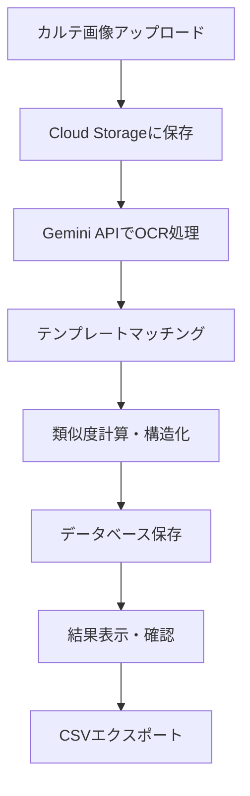

# 医療カルテ電子化システム

## 📋 プロジェクト概要

医療カルテの画像から必要な情報を自動で抽出し、構造化データとして出力するWebアプリケーションです。Google Gemini 2.5 Pro APIを活用した高精度なOCR・AI解析により、医療従事者の業務効率化を支援します。

## 🏗️ システム構成

```
┌─────────────────┐    ┌─────────────────┐    ┌─────────────────┐
│   フロントエンド   │    │   バックエンド     │    │   外部サービス    │
│   (Next.js)     │◄──►│   (FastAPI)     │◄──►│   Google Cloud   │
│                 │    │                 │    │   Services       │
└─────────────────┘    └─────────────────┘    └─────────────────┘
```

### 技術スタック

#### フロントエンド
- **Framework**: Next.js 13.5.4
- **Language**: TypeScript
- **Styling**: Tailwind CSS
- **State Management**: Zustand
- **HTTP Client**: Axios
- **UI Components**: React Beautiful DnD, React Dropzone

#### バックエンド
- **Framework**: FastAPI 0.104.0
- **Language**: Python 3.9+
- **Database**: PostgreSQL (SQLAlchemy ORM)
- **Migration**: Alembic
- **Authentication**: カスタム認証システム

#### インフラストラクチャ
- **Cloud Platform**: Google Cloud Platform
- **Container**: Docker
- **Database**: Cloud SQL (PostgreSQL)
- **Storage**: Cloud Storage
- **AI/ML**: Google Gemini 2.5 Pro API
- **Deployment**: Cloud Run

## 🚀 主な機能

### 1. カルテ画像アップロード
- ドラッグ&ドロップによる直感的なファイルアップロード
- 複数画像の一括処理対応
- サポート形式: JPEG, PNG, PDF

### 2. AI自動解析
- **OCR処理**: 画像から文字情報を高精度で抽出
- **構造化**: 医療情報を定義済みテンプレートに基づいて分類
- **類似度判定**: テンプレートとの一致度を数値化

### 3. 抽出テンプレート管理
- カスタムテンプレートの作成・編集
- 抽出項目の柔軟な設定
- 類似度閾値の調整機能

### 4. 結果確認・編集
- 抽出結果のリアルタイム表示
- 信頼度スコアの可視化
- 手動での修正・編集機能

### 5. データエクスポート
- CSV形式でのデータダウンロード
- 構造化されたJSON出力
- バッチ処理結果の一括取得

## 📊 ワークフロー



## 🔧 開発環境セットアップ

### 前提条件
- Node.js 18+
- Python 3.9+
- Docker & Docker Compose
- Google Cloud SDK

### クイックスタート

1. **リポジトリのクローン**
```bash
git clone <repository-url>
cd medical-chart-system
```

2. **環境変数の設定**
```bash
# バックエンド
cp medical-chart-backend/.env.example medical-chart-backend/.env
# フロントエンド  
cp medical-chart-frontend/.env.example medical-chart-frontend/.env
```

3. **Docker Composeでの起動**
```bash
cp docker-compose.example.yml docker-compose.yml
docker-compose up -d
```

4. **データベースマイグレーション**
```bash
cd medical-chart-backend
alembic upgrade head
```

### 個別セットアップ

#### バックエンド
```bash
cd medical-chart-backend
poetry install
poetry run uvicorn app.main:app --reload
```

#### フロントエンド
```bash
cd medical-chart-frontend
npm install
npm run dev
```

## 🌐 デプロイメント

### Google Cloud Platform

本システムはGCP上での運用を前提として設計されています。

#### 必要なGCPサービス
- Cloud Run (アプリケーション実行)
- Cloud SQL (データベース)
- Cloud Storage (ファイル保存)
- Secret Manager (機密情報管理)
- Artifact Registry (コンテナレジストリ)

#### デプロイ手順
詳細なデプロイ手順については、各環境のREADMEを参照してください：
- [バックエンドデプロイ](./medical-chart-backend/README.md)
- [フロントエンドデプロイ](./medical-chart-frontend/README.md)

## 📝 API仕様

### 主要エンドポイント

- `POST /api/v1/charts/upload` - カルテ画像のアップロード
- `GET /api/v1/charts/{chart_id}` - 処理結果の取得
- `GET /api/v1/charts/{chart_id}/status` - 処理ステータスの確認
- `POST /api/v1/templates/` - テンプレートの作成
- `GET /api/v1/templates/` - テンプレート一覧の取得

詳細なAPI仕様は `/api/docs` (Swagger UI) で確認できます。

## 🧪 テスト

### バックエンドテスト
```bash
cd medical-chart-backend
poetry run pytest
```

### フロントエンドテスト
```bash
cd medical-chart-frontend
npm run test
```

## 📁 プロジェクト構造

```
medical-chart-system/
├── medical-chart-backend/          # FastAPI バックエンド
│   ├── app/
│   │   ├── core/                   # 設定・認証
│   │   ├── db/                     # データベース関連
│   │   ├── routers/                # APIルーター
│   │   ├── schemas/                # Pydanticスキーマ
│   │   ├── services/               # ビジネスロジック
│   │   └── tasks/                  # 非同期タスク
│   ├── alembic/                    # DBマイグレーション
│   └── tests/                      # テストコード
├── medical-chart-frontend/         # Next.js フロントエンド
│   ├── app/
│   │   ├── components/             # Reactコンポーネント
│   │   ├── lib/                    # ユーティリティ
│   │   └── styles/                 # スタイル定義
│   └── types.d.ts                  # 型定義
└── docs/                           # プロジェクトドキュメント
```

## 🤝 コントリビューション

1. フォークしてください
2. フィーチャーブランチを作成してください (`git checkout -b feature/amazing-feature`)
3. 変更をコミットしてください (`git commit -m 'Add some amazing feature'`)
4. ブランチにプッシュしてください (`git push origin feature/amazing-feature`)
5. プルリクエストを作成してください

## 📄 ライセンス

**All Rights Reserved**

このプロジェクトのソースコード、ドキュメント、および関連するすべての資料は、著作権者（fumifumi0831）の所有物です。

### 利用条件

- **商用利用**: 事前の書面による許可が必要
- **再配布**: 事前の書面による許可が必要  
- **改変**: 事前の書面による許可が必要
- **フォーク**: 学習目的のみ許可（再配布・商用利用は禁止）

### 許可申請

利用許可をご希望の場合は、以下にお問い合わせください：
- Email: tonahuma77@gmail.com
- 用途、期間、範囲を明記してご連絡ください

### 免責事項

このソフトウェアは「現状のまま」提供され、明示的または暗示的な保証はありません。著作権者は、このソフトウェアの使用により生じるいかなる損害についても責任を負いません。

## 👥 開発チーム

- **Lead Developer**: fumifumi0831

## 📞 サポート

質問やサポートが必要な場合は、以下の方法でお問い合わせください：

- Issues: [GitHub Issues](../../issues)
- Email: tonahuma77@gmail.com

---

## 🔒 セキュリティ

本システムは医療情報を扱うため、以下のセキュリティ対策を実装しています：

- API認証による不正アクセス防止
- HTTPS通信の強制
- 機密情報のSecret Manager管理
- 入力値バリデーション
- SQLインジェクション対策

## 📈 パフォーマンス

- **処理速度**: 1枚あたり平均30-60秒
- **精度**: テンプレートマッチング90%以上
- **同時処理**: 最大10ファイル並行処理

## 🔄 バージョン履歴

- **v0.1.0** - 初期リリース
  - 基本的なOCR機能
  - テンプレートシステム
  - CSV出力機能 